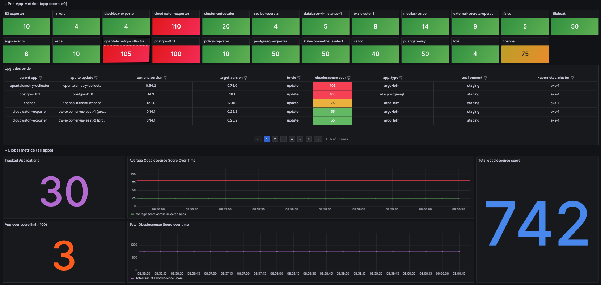
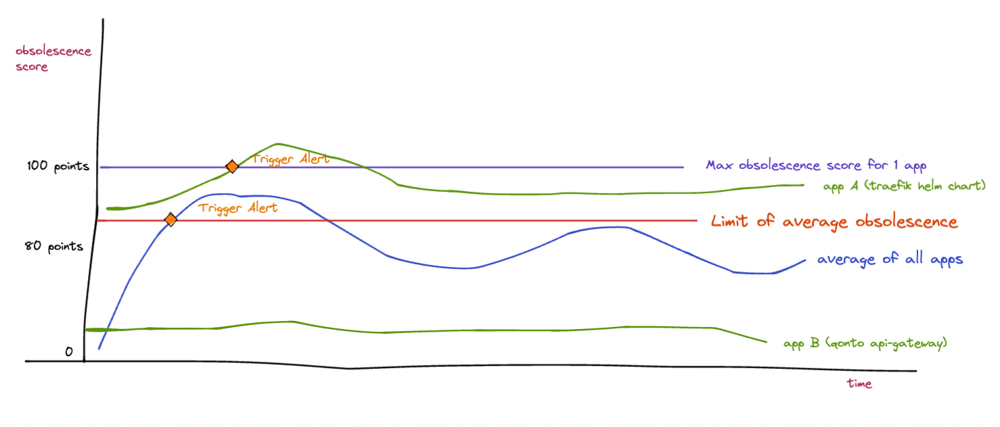

# Description

An autodiscovery tool to help you know what and when to update.


*Grafana Dashboard displaying upgrade-manager's metrics, pointing out which apps need to be upgrading and their associated versions*

Key Features:
+ **Service discovery**: finds softwares deployed (see software sources supported)
+ **Obsolescence Score SLI (Service Level Indicator) Calculation**: compute each software’s obsolescence score and expose it as a prometheus metric
+ **New eligible release detection**: automatically find the version corresponding to a tailor-made selection logic


### Managing IT system obsolescence is like being in a boat full of holes


Let's pretend your IT systems are a boat:
+ Each software is a new hole in the boat.
+ Each hole gets wider and wider as new software versions are released.
+ In such a situation, you need to decide:
    + When to patch a hole (meaning updating softwares) in order for the boat not to sink.
        + It means you need to define the minimum size (diameter) of a hole in order for the crew to consider patching it
    + When to row (do projects delivering business value) in order for the boat to make progress.
    + Which hole to patch first, and it probably makes sense to patch the widest.
        + It means you need a simple way to quickly get the list of holes that are the widest.

### How upgrade-manager responds to this issue
In real life, a software's obsolescence (how big the hole is) is hard to measure, since we don't have a clear metric to quantify it.

This is why upgrade-manager computes an **obsolescence score**, exposing it as a Prometheus metric:
+ It represents **how obsolete a system** is, based on different calculation strategies (see more about calculators). It is essentially an indicator to measure the obsolescence at an software-level 
+ It can be summed / averaged across all apps to have a company-wide freshness/obsolescence metric.

## Installation
You can use the default Helm chart to deploy upgrade-manager as follows:

```bash
helm repo add qonto oci://public.ecr.aws/qonto
helm install upgrade-manager qonto/upgrade-manager-chart \
  -n upgrade-manager --create-namespace
```

## Configuration
upgrade-manager uses yaml config file (the default location is `/app/config/config.yaml`).

For more information about specific sources' configuration block, see [sources](./doc/sources/README.md)

```yaml
global:
  interval: 10m # How often upgrade-manager should run the main loop (discovering all softwares, their new versions and compute scores)
  aws:
    region: us-east-1 # AWS region to look for resources in
sources:
  deployments:
    - <deploymentConfig>
  argocdHelm:
    - <argoCDHelmConfig>
 filesystemHelm:
    - <filesystemHelmConfig>
  aws:
    eks: <eksConfig>
    rds: <rdsConfig>
    msk: <mskConfig>
    elasticache: <elasticacheConfig>
    lambda: <lambdaConfig>
http:
  host: 0.0.0.0 # local server address
  port: 10000 # local port to listen on
  write-timeout: 10
  read-timeout: 10
  read-header-timeout: 10
```

## Required AWS Privileges when running AWS sources
To automatically discover AWS resources and their newer versions, upgrade-manager needs the following AWS privileges (represented in Terraform HCL):
```json
data "aws_iam_policy_document" "upgrade-manager" {
  statement {
    sid = "elasticache"

    actions = [
      "elasticache:DescribeCacheClusters",
      "elasticache:DescribeCacheEngineVersions",
    ]

    resources = [
      "*",
    ]
  }
  statement {
    sid = "ecr"

    actions = [
      "ecr:ListImages",
      "ecr:GetAuthorizationToken",
      "ecr:BatchGetImage",
      "ecr:GetDownloadUrlForLayer",
    ]

    resources = [
      "*",
    ]
  }
  statement {
    sid = "eks"

    actions = [
      "eks:DescribeAddon",
      "eks:DescribeAddonVersions",
      "eks:ListClusters",
      "eks:DescribeCluster",
      "eks:ListAddons",
    ]

    resources = [
      "*",
    ]
  }
  statement {
    sid = "rds"

    actions = [
      "rds:DescribeDBInstances",
      "rds:DescribeDBEngineVersions",
    ]

    resources = [
      "*",
    ]
  }
  statement {
    sid = "lambda"

    actions = [
      "lambda:ListFunctions",
    ]

    resources = [
      "*",
    ]
  }
  statement {
    sid = "kafka"

    actions = [
      "kafka:ListClustersV2",
      "kafka:GetCompatibleKafkaVersions",
    ]

    resources = [
      "*",
    ]
  }
}

```


## Problem Statement: why use upgrade-manager? 

As we scale, we deploy more and more softwares. We end up with hundreds of softwares to maintain across many different platforms.

Each of this softwares need to be updated regularly to benefit from security fixes, new features etc.


## Dashboard
To visualize metrics, you can use the dashboard available in the `dashboard/` directory

## Alerting Patterns: deciding when to update softwares
As SREs, we like to define SLOs/SLAs based on SLIs. Among other things, it helps us take actions based on specific thresholds.
Using our **obsolescence score** metric, we can now define thresholds to help us decide when we need to act and update softwares.

Each company has its own way to define alerting rules, but a sane default could be:

1. The obsolescence score for each individual software should be < 100
```yaml
- alert: ObsolecenceScoreTooHigh
  expr: upgrade_manager_software_obsolescence_score{isparent="1"} > 99
  for: 5m
  labels:
    team: foo
  annotations:
    summary: "The software {{ $labels.app }} is obsolete (>99) and needs to be updated"
    runbook_url: https://letmegooglethat.com/?q=how+to+update+softwares
```

2. The average obsolescence score for all apps should be < 80
```yaml
- alert: AverageObsolecenceScoreTooHigh
  expr: avg(upgrade_manager_software_obsolescence_score{isparent="1"}) < 80
  for: 5m
  labels:
    team: foo
  annotations:
    summary: "The average obsolescence score across all softwares is too high, softwares need to be updated" 
    runbook_url: https://letmegooglethat.com/?q=how+to+update+softwares
```


When an alert is triggered, an engineer should acknowledge it and upgrade the applications with the highest obsolescence scores.
